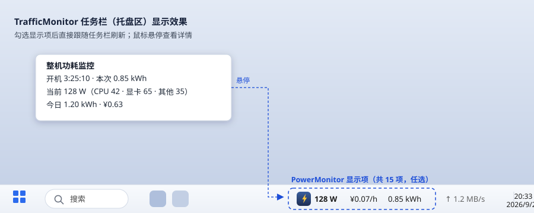
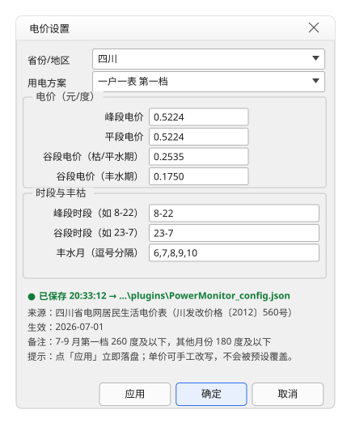
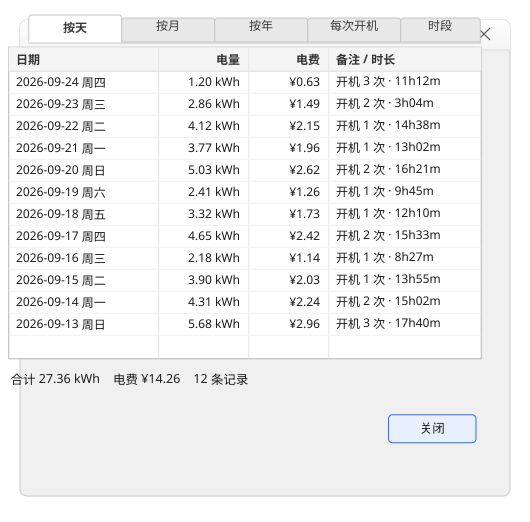
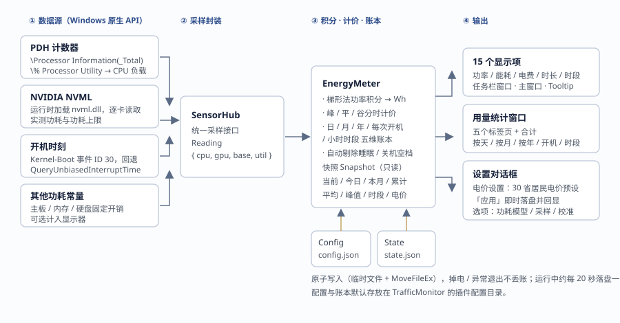

# PowerMonitor · TrafficMonitor 整机功耗监测插件

**简体中文** ｜ [English](#english)

[](LICENSE)


-0F7B37.svg)

一个 [TrafficMonitor](https://github.com/zhongyang219/TrafficMonitor) 插件：在任务栏窗口 / 主窗口里
直接显示**整机实时功率、能耗与电费**，并提供峰谷分时电价设置与多维用量统计界面。

> 作者 / 维护者：**init** ｜ 项目主页：<https://github.com/IInit>



---

## 一、功能特性

| 能力 | 说明 |
| --- | --- |
| **CPU 功耗** | 读取 PDH 计数器 `\Processor Information(_Total)\% Processor Utility` 得到 CPU 负载，代入功耗模型 `P = idle + (ppt − idle) × (util/100)^exponent`；PDH 不可用时回退 `GetSystemTimes` 差值 |
| **显卡功耗** | 运行时动态加载 `nvml.dll`（NVIDIA NVML），逐卡读取**驱动实测**功耗与功耗上限；无 NVIDIA 显卡时计 0 |
| **其他功耗** | 主板 / 内存 / 硬盘等固定开销经验常量，可选计入显示器功耗 |
| **整机校准** | CPU / GPU / 其他三分量统一乘以校准系数，便于用插座功率计比对后修正 |
| **能耗计量** | 对功率做梯形法时间积分（Wh），自动跳过睡眠 / 关机造成的时间空档 |
| **峰谷电价** | 内置全国 **30 个省级行政区**居民阶梯电价预设，支持峰 / 平 / 谷三段、跨零点时段、丰枯季节谷价 |
| **多维账本** | 按「自然日 / 月 / 年 / 每次开机 / 小时时段」五个维度累计电量与电费 |
| **统计界面** | 分页表格展示各维度用量、电费、时长、占比，并给出合计 |
| **掉电不丢** | 配置与账本以 JSON 原子写入，重启网络 / 重开 TrafficMonitor 后自动恢复 |
| **可观测** | 电价设置窗口内置「应用」按钮，点击即落盘并回显保存时间与配置文件路径 |

## 二、显示项（共 15 个）

在 TrafficMonitor 的「显示设置」中勾选需要的项目即可：

| Key | 名称 | 示例 |
| --- | --- | --- |
| `current` | 当前整机功率 | `128 W` |
| `cpu` | CPU 功耗 | `42 W` |
| `gpu` | 显卡功耗 | `65 W` |
| `base` | 其他功耗 | `35 W` |
| `cost` | 每小时电费 | `¥0.07/h` |
| `session` | 本次开机能耗 | `0.85 kWh` |
| `today` | 今日能耗 | `1.20 kWh` |
| `today_cost` | 今日电费 | `¥0.63` |
| `avg` | 本次平均功率 | `118 W` |
| `peak` | 本次峰值功率 | `210 W` |
| `uptime` | 本次开机时长 | `3:25:10` |
| `segment` | 当前电价时段 | `谷` / `平` / `峰` |
| `month` | 本月能耗 | `86.4 kWh` |
| `total` | 累计总能耗 | `312.5 kWh` |
| `total_cost` | 累计总电费 | `¥163.28` |

鼠标悬停在插件项上可看到完整提示（开机时长、本次能耗、当前功率构成、今日数据）。

## 三、右键菜单（5 个命令）

1. **用量统计…** —— 五个标签页：按天 / 按月 / 按年 / 每次开机 / 时段，底部给出合计。
2. **电价设置…** —— 选择省份与用电方案（自动填充预设电价），也可手动改单价、峰谷时段、丰水月。
3. **重置本次统计** —— 清空本次开机的能耗、电费与峰值记录（历史日 / 月 / 年累计保留）。
4. **关于…** —— 版本、作者、许可与项目主页，可直接跳转浏览器。
5. **项目主页（GitHub）…** —— 直接打开 <https://github.com/IInit>。

### 电价设置窗口

底部固定为 **应用 / 确定 / 取消** 三个按钮：点「应用」**立即写入磁盘**并在下方状态区回显
`● 已保存 hh:mm:ss → <配置文件路径>`，不必关窗即可确认是否保存成功；写盘失败会明确提示原因，
不会静默丢弃。



### 用量统计窗口



## 四、内部结构



## 五、安装

1. 在 TrafficMonitor 主窗口右键 →「选项设置」→「插件」。
2. 点击「浏览插件目录」，打开插件文件夹（通常是 `TrafficMonitor\plugins\`）。
3. 把 `PowerMonitor.dll` 复制进去（**位数必须与主程序一致，本仓库默认构建 x64**）。
4. 回到插件设置页勾选 **PowerMonitor** 并确定。
5. 在「显示设置」中勾选需要的功耗项目。

> 插件动态链接 MFC，需要 **Microsoft Visual C++ 2015-2022 运行库**（绝大多数 Windows 已自带；
> 若插件无法加载，请先安装 VC++ 可再发行组件包）。

## 六、构建

### 方式 A：Visual Studio

1. 用 VS2022 打开 `PowerMonitor.sln`，选择 `Release | x64`，生成。
   需要安装 **MFC** 组件（VS Installer → 使用 C++ 的桌面开发 → 勾选「适用于 v143 生成工具的 C++ MFC」）。
2. 产物：`x64/Release/PowerMonitor.dll`。

### 方式 B：命令行（推荐，自带冒烟测试与界面探针）

```bash
bash build_x64.sh          # 编译 → 链接 → 冒烟测试 → 对话框探针
```

脚本不依赖 MSBuild：直接调用 `cl.exe` / `link.exe`，依次完成编译、链接与两套自动化测试，
任一失败即以非 0 退出。工具链路径可用环境变量覆盖，便于在 CI 上复用：

| 变量 | 含义 | 默认值 |
| --- | --- | --- |
| `PM_TC` | MSVC 工具集目录（含 `bin/Hostx64/x64/cl.exe`） | 本机还原的工具链 |
| `PM_MSVC` | 已安装的 MSVC 目录（提供 ATL 头与 CRT 库） | VS 安装目录 |
| `PM_SDK` / `PM_SDKVER` | Windows SDK 根目录 / 版本 | `D:/Windows Kits/10` / `10.0.26100.0` |
| `PM_PYTHON` | Python 解释器（生成图标、拉取依赖） | 自动探测 |
| `PM_SKIP_DIALOG_PROBE` | 置 1 跳过界面探针（无交互桌面时） | 未设置 |

### 关于两个「不入库」的产物

为保证仓库纯文本、可审计，下面两项**不提交二进制**，由脚本确定性生成：

| 产物 | 生成方式 | 说明 |
| --- | --- | --- |
| `PowerMonitor/res/power_monitor.ico` | `python tools/make_icon.py` | 深蓝圆角方块 + 琥珀色闪电，10 种尺寸（≥64px 用 PNG 压缩） |
| `PowerMonitor/yyjson/yyjson.{h,c}` | `python tools/fetch_deps.py` | 第三方 JSON 库 **yyjson 0.4.0**，按固定版本 + SHA-256 校验下载 |

`build_x64.sh` 会在文件缺失时自动调用这两个脚本；也可手动执行。离线环境可自行把
yyjson 0.4.0 的 `src/yyjson.h`、`src/yyjson.c` 放到 `PowerMonitor/yyjson/` 下。

## 七、配置与数据文件

插件在 TrafficMonitor 的插件配置目录下维护两个 JSON（UTF-8）：

| 文件 | 内容 |
| --- | --- |
| `PowerMonitor_config.json` | 硬件模型、采样间隔、校准系数、货币符号、电价与时段 |
| `PowerMonitor_state.json` | 各维度能耗 / 电费账本（运行中约每 20 秒及退出时自动保存） |

### 硬件模型默认值

| 参数 | 默认值 | 含义 |
| --- | --- | --- |
| CPU 封装功耗上限 (W) | 142 | 满载（PL1/PPT）功耗 |
| CPU 空载功耗 (W) | 20 | 空闲功耗 |
| 负载-功耗曲线指数 | 0.85 | 指数越大，中低负载功耗越偏低 |
| 其他固定开销 (W) | 35 | 主板 / 内存 / 硬盘等 |
| 期望采样间隔 (秒) | 2.0 | 积分参考间隔（实际由主程序刷新节奏驱动） |
| 整机校准系数 | 1.0 | 用插座功率计实测后按 实测/显示 调整 |
| 计入显示器 / 功耗 (W) | 关 / 30 | 笔记本可关闭，台式外接显示器可开启 |

> CPU 功耗为**模型估算**，建议用插座功率计对比后调整 PPT、空载值与校准系数；
> NVIDIA 显卡功耗来自驱动**实测**，通常较准。

## 八、算法与数据口径

- **功率积分**：相邻两次采样之间按梯形法累计 `energy = (P_prev + P_cur) / 2 × dt / 3600`（Wh）；
  仅当 `0 < dt < 采样间隔 × 5` 时积分，从而自动剔除睡眠 / 关机造成的时间空档。
- **峰谷拆分**：每个采样区间按当前小时所属段（峰 / 平 / 谷）归类电量。时段左闭右开、支持跨零点
  （如 `23-7` 表示 23:00 至次日 7:00），峰段优先于谷段判定。
- **电费折算**：`电费 = 峰电量 × 峰价 + 平电量 × 平价 + 谷电量 × 谷价`（谷价按月份取丰 / 枯值），再除以 1000；
  累计电费为各自然日电费之和，并做单调下限保护，避免重算导致回退。
- **开机时刻**：通过事件日志 `Microsoft-Windows-Kernel-Boot` 事件 ID 30 取本次开机时间，
  并以 `QueryUnbiasedInterruptTime` 校验；失败时依次回退
  `QueryUnbiasedInterruptTime → GetTickCount64 → 当前时刻`。
- **字符串编码**：核心层统一 UTF-8 `std::string`，仅在插件 wchar_t 边界做转换。

## 九、测试

`bash build_x64.sh` 会依次运行两套 Windows 侧自动化测试：

| 测试 | 覆盖内容 |
| --- | --- |
| `tests/windows/smoke_host.cpp`（`PluginSmokeTest.exe`） | 真实加载 DLL：导出符号、15 个显示项、越界返回 `nullptr`、采样、Tooltip、5 个命令、**署名与主页必须为 init / github.com/IInit 且不含上游作者串**、配置落盘 |
| `tests/windows/dialog_probe.cpp`（`DlgProbe.exe`） | 真实打开对话框并枚举控件树：资源齐备、控件可见且未被裁剪、10 个字段非空、「应用」后回显且 JSON 落盘、确定后重开回读、多级目录自动补全、不可写路径必须报错 |

核心算法层另有跨平台单元测试 `tests/test_main.cpp`（不依赖 Windows / MFC）：

```bash
g++ -std=c++17 -I PowerMonitor \
    tests/test_main.cpp \
    PowerMonitor/Config.cpp PowerMonitor/FileUtil.cpp \
    PowerMonitor/Tariffs.cpp PowerMonitor/Meter.cpp PowerMonitor/Fields.cpp \
    PowerMonitor/yyjson/yyjson.c -o pm_test && ./pm_test
```

覆盖：时段解析、30 省预设完整性、峰平谷计价（含丰枯）、梯形积分、账本流转、跨天、
同 / 异会话恢复、配置往返、字段格式化。`tests/stub/` 提供最小 Windows 头桩，
可在非 Windows 环境对 `Sensors.cpp` / `PowerOn.cpp` 做语法检查。

## 十、目录结构

```
PowerMonitor.sln            解决方案
PowerMonitor/               插件源码（C++17 + MFC）
  Config.*   Meter.*         配置 / 积分·账本·计价
  Sensors.*  PowerOn.*       采样（PDH / NVML）与开机时刻
  Tariffs.*  Fields.*        30 省电价预设 / 15 个显示字段
  *Dlg.*                    选项、电价、统计三个对话框
  include/PluginInterface.h  TrafficMonitor 插件接口（宿主提供）
  yyjson/                    第三方 JSON（构建前自动获取）
  res/                       图标（构建前自动生成）
tests/                      单元测试与 Windows 侧冒烟测试 / 界面探针
tools/                      make_icon.py（画图标）、fetch_deps.py（取依赖）
docs/images/                README 演示图
build_x64.sh                命令行构建入口
```

## 十一、许可

MIT License，Copyright (c) 2026 **init**。

电价数据为公开资料汇总，仅供参考，实际电价请以当地供电公司 / 电费账单为准。
第三方库 `yyjson` 由 [ibireme/yyjson](https://github.com/ibireme/yyjson) 提供（MIT），
插件接口头 `PluginInterface.h` 来自 TrafficMonitor 项目（MIT）。

---

## English

**PowerMonitor** is a [TrafficMonitor](https://github.com/zhongyang219/TrafficMonitor) plugin that
shows your PC's **live power draw, energy consumption and electricity cost** right in the taskbar
window / main window, with time-of-use tariff settings and multi-dimensional usage statistics.

> Author: **init** ｜ Homepage: <https://github.com/IInit>


### Features

| Capability | Description |
| --- | --- |
| **CPU power** | Reads the PDH counter `\Processor Information(_Total)\% Processor Utility` and applies the model `P = idle + (ppt − idle) × (util/100)^exponent`; falls back to `GetSystemTimes` deltas when PDH is unavailable |
| **GPU power** | Loads `nvml.dll` at runtime (NVIDIA NVML) and reads **driver-measured** power and power limits per card; reports 0 without an NVIDIA GPU |
| **Other power** | Empirical constant for mainboard / RAM / disks, optionally including the monitor |
| **Calibration** | A single multiplier applied to all three components, so you can match a wall-plug meter |
| **Energy accounting** | Trapezoidal integration of power over time (Wh); sleep / shutdown gaps are skipped automatically |
| **Peak / valley tariffs** | Built-in residential tiered tariffs for **30 provincial regions** of China, with peak / flat / valley segments, midnight-crossing windows and wet/dry season valley prices |
| **Multi-dimensional ledger** | Energy and cost accumulated per **day / month / year / boot session / hour-of-day** |
| **Statistics UI** | A tabbed table with usage, cost, duration and share per dimension, plus totals |
| **Crash-safe storage** | Config and ledger are written atomically as JSON and restored on restart |
| **Verifiable saving** | The tariff dialog has an **Apply** button that persists immediately and echoes the save time and config path |

### Display items (15)

Enable them under TrafficMonitor's *Display settings*:
`current`, `cpu`, `gpu`, `base`, `cost`, `session`, `today`, `today_cost`, `avg`, `peak`,
`uptime`, `segment`, `month`, `total`, `total_cost` (examples: `128 W`, `¥0.07/h`, `0.85 kWh`,
`¥0.63`, `3:25:10`, `谷` / `平` / `峰`, `312.5 kWh`).

### Context menu (5 commands)

1. **Usage statistics…** — five tabs: by day / month / year / boot session / hour-of-day, with totals.
2. **Tariff settings…** — pick a region and plan (presets filled in automatically), or edit prices,
   peak/valley windows and wet-season months by hand.
3. **Reset current session** — clears this boot's energy, cost and peak records (history is kept).
4. **About…** — version, author, license and homepage link.
5. **Homepage (GitHub)…** — opens <https://github.com/IInit>.


### Install

1. Right-click the TrafficMonitor window → *Options* → *Plugins*.
2. Click *Browse plugin folder* to open `TrafficMonitor\plugins\`.
3. Copy `PowerMonitor.dll` in — **the architecture must match the host (this repo builds x64)**.
4. Back in the plugin page, tick **PowerMonitor** and confirm.
5. Tick the items you want in *Display settings*.

> The plugin links MFC dynamically, so the **Microsoft Visual C++ 2015-2022 Redistributable** is
> required (present on most systems; install it if the plugin fails to load).

### Build

```bash
bash build_x64.sh      # compile → link → smoke test → dialog probe
```

Or open `PowerMonitor.sln` in Visual Studio 2022 (`Release | x64`, requires the **MFC** component).
The script calls `cl.exe` / `link.exe` directly (no MSBuild) and can be reused in CI through the
`PM_TC`, `PM_MSVC`, `PM_SDK`, `PM_SDKVER`, `PM_PYTHON` and `PM_SKIP_DIALOG_PROBE` environment variables.

Two artefacts are intentionally **not committed** to keep the repository text-only — both are
regenerated deterministically:

| Artefact | Generated by |
| --- | --- |
| `PowerMonitor/res/power_monitor.ico` | `python tools/make_icon.py` |
| `PowerMonitor/yyjson/yyjson.{h,c}` | `python tools/fetch_deps.py` (yyjson **0.4.0**, pinned by SHA-256) |

### Configuration files

`PowerMonitor_config.json` (hardware model, sampling, calibration, tariff) and
`PowerMonitor_state.json` (energy / cost ledger) live in TrafficMonitor's plugin config directory.

### Tests

`PluginSmokeTest.exe` loads the real DLL and checks exports, the 15 items, out-of-range handling,
sampling, tooltip, the 5 commands, **the author/homepage strings (init / github.com/IInit, and no
upstream author string)** and config persistence. `DlgProbe.exe` opens the dialogs for real and
enumerates the control tree: resources present, controls visible and inside the client area, all
fields non-empty, *Apply* persisting to disk with an echo, values re-read after reopening,
recursive directory creation and an explicit error on unwritable paths.

`tests/test_main.cpp` is a cross-platform unit test for the pure logic layer (no Windows / MFC).

### License

MIT License, Copyright (c) 2026 **init**. Tariff data is compiled from public sources and is for
reference only — always check your local utility bill. `yyjson` is by
[ibireme/yyjson](https://github.com/ibireme/yyjson) (MIT); `PluginInterface.h` comes from the
TrafficMonitor project (MIT).
